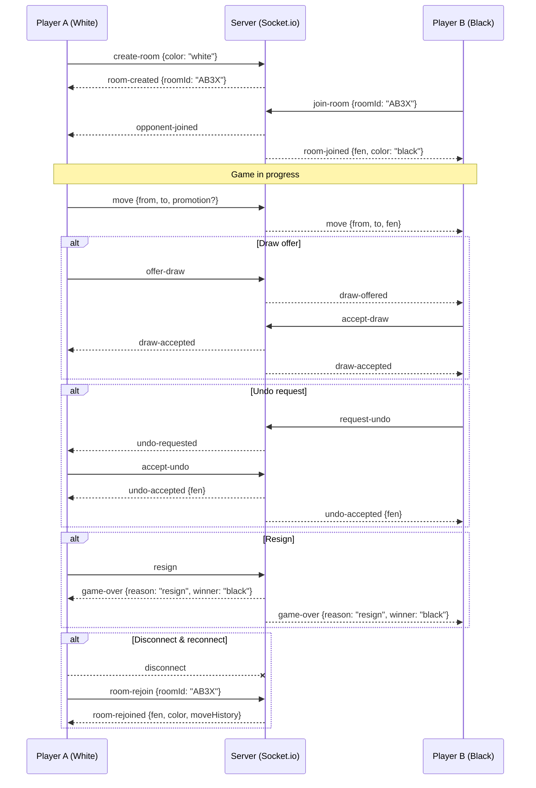

# RVIGNA CHESS

A browser-based chess game with a minimal Node.js backend. All chess logic — move validation, AI, analysis, PGN — runs entirely in the browser. The server only handles online room coordination via Socket.io; local games work fully offline.

## Features

### Chess Rules
- Complete rule set: castling (kingside and queenside), en passant, pawn promotion
- Draw conditions: 50-move rule, threefold repetition, insufficient material, stalemate
- Check and checkmate detection with visual highlight on the king square

### Local Game Modes
- **2-player local** — pass-and-play on one device
- **vs Computer** — three difficulty levels:
  - *Easy* — greedy 0-ply with high randomness
  - *Normal* — 1-ply minimax with piece-square tables
  - *Hard* — 2-ply minimax, lower randomness, endgame king-push heuristic
- Computer always plays the chosen color; board flips so the human faces upward

### Online Multiplayer
- Create a room and share the 4-character code; opponent joins by entering it
- Real-time move sync via Socket.io (no polling)
- Draw offers and undo requests with accept/decline dialogs
- Opponent-disconnect detection and reconnect handling
- Color choice (White / Black / Random) before starting

### Move History & Navigation
- Full scrollable move list with algebraic notation
- Browse any past position during a live game (arrow keys or click a move)
- Board and captured-pieces display update to the browsed position without leaving the live game
- Post-import review mode for PGN games

### Post-game Analysis
- Runs entirely in the browser after the game ends
- Each move is scored by replaying the position and comparing the played move to the best available move (centipawn loss)
- Move quality badges: **Best** (≤5 cp) · **Good** (≤20 cp) · **Okay** (≤50 cp) · **Inaccuracy** (≤100 cp) · **Mistake** (≤200 cp) · **Blunder** (>200 cp)
- Per-player accuracy percentage and blunder/mistake/inaccuracy counts
- Side-by-side player comparison cards in the analysis modal

### PGN
- Import a PGN string to replay any game
- Export the current game as a PGN with standard headers (Event, Date, Result, White, Black)

### UI & UX
- Responsive layout: desktop sidebar, tablet toolbar, mobile bottom sheet
- Board coordinates on all four sides (rank and file labels flip with the board)
- Captured pieces display with material advantage score
- Promotion dialog with piece selector
- Sound effects for moves, captures, castling, promotion, check, game end, draw
- Sound toggle button
- Server connection status dot in the header (green = reachable, grey = offline)

### Progressive Web App
- Installable on desktop and mobile (Web App Manifest)
- Service worker pre-caches all assets — local games work fully offline
- All vendor assets (Font Awesome, fonts, Socket.io client) are self-hosted

## Architecture

All chess logic runs in the browser. The server is only involved for online multiplayer.

| Concern | Where it runs |
|---|---|
| Move validation | Browser (`chess-engine.js`) |
| AI / computer moves | Browser (`chess-engine.js`) |
| Post-game analysis | Browser (`chess-engine.js`) |
| PGN import / export | Browser (`chess-engine.js`) |
| Game state persistence | `localStorage` |
| Online room sync | Server (Socket.io) |

`chess-engine.js` is auto-generated and minified from the `src/` modules by `build-engine.js` (uses terser, −57% raw size). Run `npm run build` after editing any source file.

The server exposes only two HTTP endpoints:

- `GET /api/ping` — health check (drives the connection-status dot)
- `GET /api/rooms/open` — list rooms waiting for a second player

Everything else is static file serving and Socket.io.

## Getting Started

```bash
npm install
npm start          # production
npm run dev        # with auto-reload (nodemon)
npm run build      # regenerate + minify chess-engine.js after editing src/
```

Then open [http://localhost:3000](http://localhost:3000).

## Project Structure

```
server.js              # Express + Socket.io — static files + online rooms only
build-engine.js        # Transforms + minifies src/ into public/chess-engine.js
src/
  chess.js             # Chess rules, move validation, game state
  ai.js                # Computer opponent (minimax + piece-square tables)
  analysis.js          # Post-game move quality analysis
  pgn.js               # PGN import / export
  rooms.js             # Online multiplayer room management
public/
  chess-engine.js      # Browser bundle — minified, auto-generated — do not edit
  client.js            # UI, local engine calls, socket.io client
  index.html
  style.css
  sw.js                # Service worker — pre-caches all assets for offline use
  manifest.json
  pieces/              # SVG chess pieces
  icons/               # PWA icons
  vendor/              # Self-hosted fonts, Font Awesome, socket.io client
```

## Online Play

1. One player clicks **Play Online → Create Room** and shares the room code.
2. The second player clicks **Play Online → Join Room** and enters the code.
3. Each player sees the board from their own perspective (board flips for black).
4. Draw offers and undo requests are sent in-room and require the opponent to accept.



## Keyboard Shortcuts

| Key | Action |
|-----|--------|
| ← / ↑ | Previous move |
| → / ↓ | Next move |
| Home | First move |
| End | Last move |
